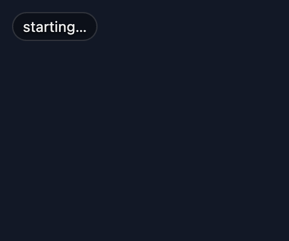
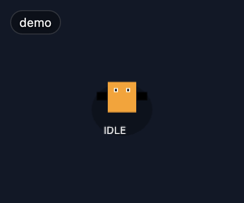
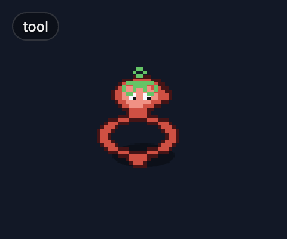
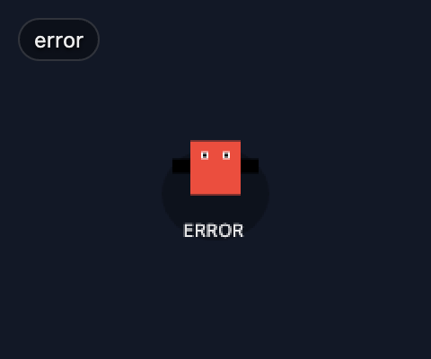

# MightComeback/molt-mascot

A tiny always-on-top desktop mascot (pixel lobster) that reflects your local **OpenClaw** Gateway state in real time.

## States

| State | Description |
|-------|-------------|
| **idle** | Agent is idle; after 2 minutes transitions to **sleeping** (ZZZ overlay) |
| **thinking** | Agent is generating a response |
| **tool** | Agent is executing a tool call (shows tool name in HUD) |
| **error** | Something went wrong (shows error message in HUD) |
| **connecting** | Establishing WebSocket connection to Gateway |
| **connected** | Handshake succeeded (brief sparkle animation, then idle) |
| **sleeping** | Idle for >2 minutes; ZZZ overlay (configurable via `MOLT_MASCOT_SLEEP_THRESHOLD_S`) |
| **disconnected** | Lost connection; shows reconnect countdown with exponential backoff |

## Screenshots







## Quickstart

### 1. Install Plugin (optional, recommended)

The mascot can run **without** the plugin by mapping native Gateway `agent` events to modes. Connection states (`connecting`/`connected`/`disconnected`) work without the plugin.

Installing the companion plugin improves correctness (nested tools, error details, server-side timers) and lets you sync UX knobs like `clickThrough`/`alignment` from Gateway config.

```bash
# From npm (recommended for most users)
clawdbot plugins install @molt/mascot-plugin

# Or from the monorepo root (local dev)
# (build first so dist/ + clawdbot.plugin.json are up to date)
bun run --cwd packages/molt-mascot-plugin build
clawdbot plugins install ./packages/molt-mascot-plugin
```

- npm package: https://www.npmjs.com/package/@molt/mascot-plugin

### 2. Run App

```bash
bun install

# Simplest: pass gateway URL directly
bun run mascot -- --gateway ws://127.0.0.1:18789 --token YOUR_TOKEN

# Debug mode (auto-opens DevTools on launch):
bun run mascot -- --gateway ws://127.0.0.1:18789 --token YOUR_TOKEN --debug

# Or via env vars:
export GATEWAY_URL=ws://127.0.0.1:18789
export GATEWAY_TOKEN=...
bun run mascot
```

### UX toggles

- **Click-through** (mascot never blocks clicks): set `MOLT_MASCOT_CLICKTHROUGH=1` (or `MOLT_MASCOT_CLICK_THROUGH=1`)
  - Toggle at runtime with **Cmd/Ctrl+Shift+M**
- **Quit application**: **Cmd/Ctrl+Option+Q** (the dock icon is hidden on macOS)
- **Hide Text** (pixel-only mode): set `MOLT_MASCOT_HIDE_TEXT=1` (or legacy `MOLT_MASCOT_HIDETEXT=1`) to hide the status pill/HUD.
  - Toggle at runtime with **Cmd/Ctrl+Shift+H**
- **Show/Hide Mascot**: **Cmd/Ctrl+Shift+V** (toggle window visibility)
- **Cycle Alignment**: **Cmd/Ctrl+Shift+A** (cycle through all 9 alignment positions)
- **Reset State**: **Cmd/Ctrl+Shift+R** (force idle/clear error)
- **Snap to Position**: **Cmd/Ctrl+Shift+S** (reset manual drag, reposition to current alignment)
- **Cycle Size**: **Cmd/Ctrl+Shift+Z** (cycle through tiny → small → medium → large → xlarge window sizes)
- **Cycle Opacity**: **Cmd/Ctrl+Shift+O** (cycle through 100% → 80% → 60% → 40% → 20%)
- **DevTools**: **Cmd/Ctrl+Shift+D** (toggle detached DevTools for debugging WS frames)
- **Alignment**: `MOLT_MASCOT_ALIGN` (default: `bottom-right`)
  - Values: `bottom-right`, `bottom-left`, `top-right`, `top-left`, `top-center`, `bottom-center`, `center-left`, `center-right`, `center`
  - Note: `center` ignores padding; all other alignments use `MOLT_MASCOT_PADDING`.
  - Edge padding: `MOLT_MASCOT_PADDING` (default: `24`)
- **Opacity**: `MOLT_MASCOT_OPACITY` (default: `1.0`, range: `0.0`-`1.0`)
- **Size preset**: `MOLT_MASCOT_SIZE` (values: `tiny`, `small`, `medium`, `large`, `xlarge`; default: `medium`)
- **Window Size**: `MOLT_MASCOT_WIDTH` (default: 240) / `MOLT_MASCOT_HEIGHT` (default: 200)
- **Debug**: `MOLT_MASCOT_DEBUG=1` — opens DevTools on launch (equivalent to `--debug`)
- **Disable GPU**: `MOLT_MASCOT_DISABLE_GPU=1` — disables hardware acceleration (useful on VMs, Wayland, remote desktops; equivalent to `--disable-gpu`)
- **Start hidden**: `MOLT_MASCOT_START_HIDDEN=1` — launch hidden (tray-only); toggle visibility with **Cmd/Ctrl+Shift+V**
- **No tray**: `MOLT_MASCOT_NO_TRAY=1` — disable system tray icon entirely (useful on Linux DEs without tray support; equivalent to `--no-tray`)
- **No shortcuts**: `MOLT_MASCOT_NO_SHORTCUTS=1` — disable global keyboard shortcuts (use tray/context menu instead; equivalent to `--no-shortcuts`)
- **Reduced motion**: `MOLT_MASCOT_REDUCED_MOTION=1` — force reduced motion (disables bobbing, blinking, pill pulse) without changing OS accessibility settings
- **Capture dir**: `MOLT_MASCOT_CAPTURE_DIR=<path>` — screenshot capture directory; on launch, renders all mascot states + tray sprites to this folder and exits (useful for CI asset generation, equivalent to `--capture-dir`)
- **Timing knobs** (no plugin required):
  - `MOLT_MASCOT_IDLE_DELAY_MS` (default: 800)
  - `MOLT_MASCOT_ERROR_HOLD_MS` (default: 5000)
  - `MOLT_MASCOT_SLEEP_THRESHOLD_S` (default: 120) — seconds idle before showing ZZZ sleep overlay
- **Connection tuning** (no plugin required):
  - `MOLT_MASCOT_RECONNECT_BASE_MS` (default: 1500) — initial reconnect delay
  - `MOLT_MASCOT_RECONNECT_MAX_MS` (default: 30000) — max reconnect delay (exponential backoff cap)
  - `MOLT_MASCOT_STALE_CONNECTION_MS` (default: 15000) — force reconnect if no WS message within this window
  - `MOLT_MASCOT_STALE_CHECK_INTERVAL_MS` (default: 5000) — how often to check for stale connections
  - `MOLT_MASCOT_POLL_INTERVAL_MS` (default: 1000) — plugin state poll frequency (lower = more responsive, higher = less CPU)
- **Env seeding** (no UI typing): `GATEWAY_URL` / `GATEWAY_TOKEN` (also `OPENCLAW_GATEWAY_URL` / `OPENCLAW_GATEWAY_TOKEN`; legacy `CLAWDBOT_*` still accepted)
- **System tray**: Right-click the red tray icon for a menu with all toggles (macOS dock icon is hidden)
- **Double-click pill**: Copies the current status text to clipboard
- **Middle-click pill**: Toggles hide-text mode (pixel-only)
- **Double-click lobster**: Toggles ghost mode (click-through)
- **Mouse wheel on lobster**: Adjusts opacity in 10% steps (scroll up = more opaque, down = more transparent)
- **Middle-click lobster**: Force reconnect to Gateway

### Keyboard shortcuts summary

| Shortcut | Action |
|---|---|
| Cmd/Ctrl+Shift+M | Toggle ghost mode (click-through) |
| Cmd/Ctrl+Shift+H | Toggle hide text |
| Cmd/Ctrl+Shift+V | Show/hide mascot window |
| Cmd/Ctrl+Shift+A | Cycle alignment position |
| Cmd/Ctrl+Shift+R | Reset state (force idle) |
| Cmd/Ctrl+Shift+S | Snap to position (reset manual drag) |
| Cmd/Ctrl+Shift+Z | Cycle window size (tiny → small → medium → large → xlarge) |
| Cmd/Ctrl+Shift+O | Cycle opacity (100% → 80% → 60% → 40% → 20%) |
| Cmd/Ctrl+Shift+C | Force reconnect to Gateway |
| Cmd/Ctrl+Shift+P | Copy status text to clipboard |
| Cmd/Ctrl+Shift+I | Copy debug info to clipboard |
| Cmd/Ctrl+Shift+D | Toggle DevTools |
| Cmd/Ctrl+Alt+Q | Quit application |

### Mouse interactions

| Interaction | Action |
|---|---|
| Double-click pill | Copy status text to clipboard |
| Middle-click pill | Toggle hide-text mode (pixel-only) |
| Double-click lobster | Toggle ghost mode (click-through) |
| Mouse wheel on lobster | Adjust opacity ±10% |
| Middle-click lobster | Force reconnect to Gateway |
| Right-click pill or lobster | Open context menu |
| Drag window | Reposition (overrides alignment until Snap) |

### CLI flags

```
molt-mascot [options]

Options:
  -v, --version          Print version and exit
  -h, --help             Print this help and exit
  --gateway <url>        Gateway WebSocket URL (overrides env)
  --token <token>        Gateway auth token (overrides env)
  --align <position>     Window alignment (overrides env/saved prefs)
  --size <preset>        Size preset: tiny, small, medium, large, xlarge
  --opacity <0.0-1.0>    Window opacity (overrides env/saved prefs)
  --padding <px>         Edge padding in pixels (overrides env/saved prefs)
  --click-through        Start in ghost mode (click-through)
  --hide-text            Start with HUD text hidden
  --debug                Open DevTools on launch
  --disable-gpu          Disable hardware acceleration (useful on VMs, Wayland, remote desktops)
  --min-protocol <n>     Minimum Gateway protocol version (default: 2)
  --max-protocol <n>     Maximum Gateway protocol version (default: 3)
  --list-prefs           Print saved preferences and exit
  --reset-prefs          Clear saved preferences and start fresh
  --sleep-threshold <s>  Idle seconds before sleep overlay (default: 120)
  --idle-delay <ms>      Delay before returning to idle after activity (default: 800)
  --error-hold <ms>      How long to show error state before reverting (default: 5000)
  --reduced-motion       Disable animations (bob, blink); overrides OS preference
  --status               Print resolved config summary and exit
  --start-hidden         Launch hidden (tray-only); toggle with Cmd/Ctrl+Shift+V
  --no-tray              Disable system tray icon (useful on Linux DEs without tray support)
  --no-shortcuts         Disable global keyboard shortcuts (use tray/context menu instead)
  --status --json        Print resolved config as JSON (for scripting/CI)
  --capture-dir <path>   Screenshot capture directory (dev/CI asset generation)
```

## Project Structure

- `apps/molt-mascot` (@molt/mascot): The Electron desktop app.
- `packages/molt-mascot-plugin` (@molt/mascot-plugin): The optional OpenClaw server plugin.
- `tools/`: Dev scripts (WS dump, etc).

## Dev tools

Dump raw Gateway frames:

```bash
GATEWAY_URL=ws://127.0.0.1:18789 GATEWAY_TOKEN=... bun run ws:dump --once

# If you're on an older/newer Gateway build, you can override protocol negotiation:
# bun run ws:dump --once --min-protocol 2 --max-protocol 3
# (or env: GATEWAY_MIN_PROTOCOL / GATEWAY_MAX_PROTOCOL)

# If your Gateway is slow to answer hello-ok, increase once timeout (default 5000ms):
# bun run ws:dump --once --timeout-ms 12000
# (or env: GATEWAY_ONCE_TIMEOUT_MS)
```

Quick diagnostics (all accept `GATEWAY_URL` / `GATEWAY_TOKEN` env vars):

```bash
bun run ws:health   # Health check (exit 0=healthy, 1=degraded/unhealthy, 2=failed)
bun run ws:ping     # Measure plugin state round-trip latency (5 pings)
bun run ws:state    # Print current plugin state and exit
bun run ws:reset    # Reset plugin state (clear error/counters) and exit
bun run ws:watch    # Continuously poll plugin state; print only on change
```

Regenerate screenshots:

```bash
bun run screenshots
```

## Plugin (optional)

There's a small OpenClaw plugin included (`packages/molt-mascot-plugin`) that exposes a simplified RPC method.

Recommended (follows `pluginId.action`):
- `@molt/mascot-plugin.state` → `{ ok: true, state: { mode, since, lastError?, currentTool?, alignment, clickThrough, hideText, padding, opacity } }`
- `@molt/mascot-plugin.reset` → `{ ok: true, state }` (clears error + forces `idle`)

Back-compat aliases:
- `molt-mascot-plugin.state` / `molt-mascot.state` / `moltMascot.state` / `moltMascotPlugin.state` → same payload
- `molt-mascot-plugin.reset` / `molt-mascot.reset` / `moltMascot.reset` / `moltMascotPlugin.reset` → same payload

Config lives under `plugins.entries["@molt/mascot-plugin"].config`.

Back-compat: the plugin will also read config under alias keys like `plugins.entries["molt-mascot"].config` (same set as the method aliases), which helps when migrating older setups.

Supported keys:
- `alignment` (string): same values as `MOLT_MASCOT_ALIGN`
- `clickThrough` (boolean): enable click-through mode
- `hideText` (boolean): hide status text (pixel-only mode)
- `idleDelayMs` (number): idle timeout (default 800)
- `errorHoldMs` (number): error display duration (default 5000)
- `opacity` (number): window opacity (0.0 - 1.0)
- `padding` (number): screen edge padding
- `size` (string): window size preset (`tiny`, `small`, `medium`, `large`, `xlarge`)

(Loading plugins requires an OpenClaw config change + gateway restart; do it when you're awake.)

## Troubleshooting

- **Start here:** run `molt-mascot --status` to see the resolved config (env vars + saved prefs + CLI overrides). This answers "what settings will the mascot actually use?" without launching the GUI. Use `--status --json` for machine-readable output.
- If the mascot stays in **offline**/**disconnected**, confirm `GATEWAY_URL` points at your local Gateway (and that the Gateway is running).
  - Quick sanity check:
    ```bash
    GATEWAY_URL=ws://127.0.0.1:18789 GATEWAY_TOKEN=... bun run ws:dump --once
    ```
    You should see at least one frame after connect; if you see auth/protocol errors, fix URL/token or override protocol bounds (`--min-protocol` / `--max-protocol`).
  - Run `bun run ws:health` for a quick health check — exits 0 if healthy, 1 if degraded/unhealthy, 2 if connection failed.
- If the mascot connects but never leaves **idle**, confirm you're on a recent OpenClaw build and that your Gateway is emitting agent/tool lifecycle events. Use `bun run ws:state` to check current plugin state, or `bun run ws:watch` to monitor state changes in real time.
- If you enabled the plugin but `@molt/mascot-plugin.state` fails, verify the plugin id is consistent across `packages/molt-mascot-plugin/clawdbot.plugin.json` (`id`), the plugin entry in your OpenClaw config (`plugins.entries.<id>`), and the runtime export (derived from `package.json` `name`, i.e. `export const id = pkg.name`). (The plugin also supports method aliases like `molt-mascot.state` / `moltMascot.state` if you have older configs.)
- **Latency issues:** run `bun run ws:ping` to measure round-trip latency to the gateway. High latency (>200ms) or jitter may indicate network issues or an overloaded gateway.

## Develop

```bash
bun install

# Run the mascot app
bun run mascot

# Or run everything in watch mode (monorepo)
bun run dev

# Checks
bun run lint
bun run test

# All CI checks at once (lint + format + typecheck + test)
bun run check

# Auto-format
bun run format
```

## Linear workflow

This repo is tracked in Linear as **MIG-15**. Keep commits small and link them in the issue.

## Package manager notes

This repo uses **Bun** for installs + running scripts (see `package.json` `packageManager` + `scripts`).

- Recommended: `bun install`
- Avoid `npm install` here (lockfile + scripts are Bun-first).

## Build & install (monorepo)

See **Quickstart → Install Plugin** above for both npm install and local-dev install instructions.

## Publish

The plugin package name on npm is **@molt/mascot-plugin**.

